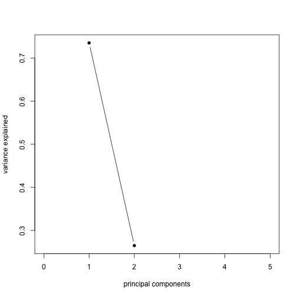
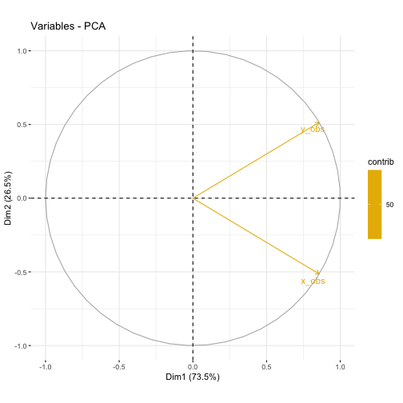

<script type="text/javascript">
document.addEventListener("DOMContentLoaded", function() {
  document.querySelector("h1").className = "title";
});
</script>
<script type="text/javascript">
document.addEventListener("DOMContentLoaded", function() {
  var links = document.links;  
  for (var i = 0, linksLength = links.length; i < linksLength; i++)
    if (links[i].hostname != window.location.hostname)
      links[i].target = '_blank';
});
</script>
<style type="text/css" scoped>
body {
  margin: 0px auto;
  max-width: 1134px;
  font-family: sans-serif;
  font-size: 10pt;
}

/* Table of contents style */

div#TOC ul {
  padding: 0px 0px 0px 45px;
  list-style: none;
  background-image: none;
  background-repeat: none;
  background-position: 0;
  font-size: 10pt;
  font-family: Helvetica, Arial, sans-serif;
}

div#TOC > ul {
  padding: 0px 150px 0px 65px;
  font-size: 12pt;
}

div#TOC > ul > li {
  padding: 5px 0px 0px 0px;
}

div#TOC ul ul {
  font-size: 11pt;
}

div#TOC.tocify ul {
  padding: 0px;
  font-size: inherit;
  font-family: inherit;
}

div#TOC.tocify li {
  padding: 5px;
  font-size: inherit;
  font-family: inherit;
}

p, dl {
  padding: 0px 150px 0px 65px;
  text-align: justify;
}

/* vertical content spacing */
p, img, table {
  margin-top: 10px;
  margin-bottom: 10px;
}

/* lists */
ol, ul {
  padding: 0px 150px 0px 100px;
  list-style: square;
}

li ol, li ul {
  padding: 0px 0px 0px 35px;
}

li p {
  padding: 0;
}

pre {
  margin: 0em 150px 0.5em 0em;
  padding: 0px 0px 0px 65px;
  border: 0px none;
  background-color: #f0f0f0;
  white-space: pre;
  overflow-x: auto;
  font-size: 90%;
}

li pre {
  margin: 0em 0px 0.5em -65px;
  padding: 0px 0px 0px 65px;
}
pre code {
  background-color: inherit;
  display: block;
  padding: 10px 10px 10px 0px;
  overflow-x: inherit;
  font-size: 100%;
}

/* markdown v1 */
pre code[class] {
  background-color: inherit;
}

/* markdown v2 */
pre[class] code {
  background-color: inherit;
}

tt, code, pre {
   font-family: 'DejaVu Sans Mono', 'Droid Sans Mono', 'Lucida Console', Consolas, Monaco, monospace;
}

h1, h2, h3, h4, h5, h6 { 
  font-family: Helvetica, Arial, sans-serif;
  margin: 1.2em 150px 0.6em 0em;
/* hanging headings */
  padding-left: 65px;
  text-indent: -65px;
}

h1.title {
  color: #87b13f;
  line-height: 1.1em;
  margin-top: 25px;
  border-bottom: 0px;
}

h1 {
  line-height: 1.4em;
  border-bottom: 1px #1a81c2 solid;
}

h1, h2, h3 {
  color: #1a81c2;
}

h1 {
  font-size: 18.0pt;
}

h2 {
  font-size: 14.5pt;
}

h3, h4 {
  font-size: 12pt;
}

span.header-section-number {
  float: left;
  width: 65px;
}

/* document header */

p.author-name {
  font-size: 14.5pt;
  font-weight: bold;
  font-style: italic;
  text-align: left;
}

.date {
  text-indent: 0px;
  font-weight: bold;
}

.abstract, .package {
  font-weight: bold;
}

/* formatting of inline code */
code { 
  background-color: #f0f0f0;
  color: #404040;
  font-size: 90%;
}

/* figures */

.figure { 
  margin: 0em 0px 0.5em;
}

img {
  max-width: 100%;
  display: block;
  padding: 0px 150px 0px 130px;
}

p > img {
  padding-left: 65px;
  padding-right: 0px;
}

img.smallfigure {
  padding-left: 195px;
  padding-right: 280px;
}

p > img.smallfigure {
  padding-left: 130px;
  padding-right: 130px;
}

img.widefigure {
  padding-left: 65px;
  padding-right: 85px;
  margin-right: -65px;
}

p > img.widefigure {
  padding-left: 0px;
  padding-right: 0px;
  margin-right: -65px;
}

p.caption, caption {
  color: inherit;
  font-size: 8pt;
}

p.caption {
  padding-left: 130px;
  padding-right: 85px;
  margin-bottom: 20px;
}

caption {
  padding: 0px;
  margin-bottom: 10px;
  min-width: 583;
}
span.caption-title {
  color: #1a81c2;
  font-weight: bold;
}

span.caption-label {
  font-weight: bold;
}

/* tables */

table {
  margin-left: 130px;
  margin-right: 85px;
}

.table {
  max-width: 518px;
}

/* definition lists */

dd {
  margin-left: 65px;
  margin-bottom: 10px;
}

/* code folding buttons */

.code-folding-btn {
  position: relative;
  margin-top: -26px;
  top: 26px;
}

.col-md-12 {
  min-height: 0px;
}

/* footnotes as sidenotes */

.sidenote {
  float: right;
  clear: right;
  margin-right: -150px;
  width: 130px;
  margin-top: 0;
  margin-bottom: 1rem;
  font-size: 8pt;
  line-height: 1.3;
  vertical-align: baseline;
  position: relative;
  text-align: left;
}

.sidenote-number, .affil-mark {
  position: relative;
  vertical-align: super;
  font-size: 7.5pt;
  font-weight: normal;
  font-style: normal;
  line-height: normal;
}

input.margin-toggle { display: none; }

label.sidenote-number { display: inline; }

label.margin-toggle:not(.sidenote-number) { display: none; }

/* Class described in https://benjeffrey.com/posts/pandoc-syntax-highlighting-css
   Colours from https://gist.github.com/robsimmons/1172277 */

code > span.kw { color: #E07020; } /* Function calls */
code > span.dt { color: #404040; } /* Function args */
code > span.dv { color: #D02070; } /* DecVal (decimal values) */
code > span.bn { color: #d14; } /* BaseN */
code > span.fl { color: #D02070; } /* Float */
code > span.ch { color: #40A040; } /* Char */
code > span.st { color: #40A040; } /* String */
code > span.co { color: #808080; font-style: italic; } /* Comment */
code > span.ot { color: #2020F0; } /* Keywords */
code > span.al { color: #ff0000; font-weight: bold; } /* AlertToken */
code > span.fu { color: #E07020; } /* Function calls */ 
code > span.er { color: #FF0000; } /* ErrorTok */

code > span.identifier { color: #404040; }
code > span.number { color: #D02070; }
code > span.string { color: #40A040; }
code > span.comment { color: #808080; font-style: italic; }
code > span.keyword { color: #2020F0; }
code > span.literal { color: #2020F0; }
code > span.operator { color: #000000;}
code > span.paren { color: #000000;}

/* proper positioning of ggplotly graphics, see https://support.bioconductor.org/p/97609/ */

.js-plotly-plot .plotly {
  padding-left: 65px;
}
</style>

# PCA in R
In R, there are several functions from different packages that allow us to perform PCA. These include;

* svd() (stats)  *** on centered data** 
* prcomp() (stats)
* princomp() (stats)  ** on cor matrix **
* PCA() (FactoMineR)
* dudi.pca() (ade4)

**Note, although prcomp sets scale=FALSE for consistency with S, in general scaling is advised. We will demonstrate first pca of unscaled and then scaled data. Scaling scaled the variables to have unit variance and is advised before  analysis takes place.** 

We will demonstrate some of these and explore these using exploR


# Equivalents across methods

Give an input matrix P and result res

|Function | loadings | scores | plot|
| :------------- |:-------------| :-----| :-----|
|prcomp(P, center=TRUE, scale=TRUE) | res\$rotation |res\$x | biplot(res)|
|princomp(P, cor=TRUE) | res$loadings | res\$scores | biplot(res)|
|PCA(P) | res\$svd\$V | res\$ind\$coord | plot(res)|
|dudi.pca(P, center=TRUE, scale=TRUE) | res\$c1 | res\$li | scatter(res)|


With ade4::dudi.pca and prcomp the default is center = TRUE, scale = TRUE.But  with princomp, cor=FALSE by default. 


#  Toy data
Create a cloud of points; two vectors, x,y of length 100. 


```r
 set.seed(2)             #sets the seed for random number generation.
 x <- 1:100              #creates a vector x with numbers from 1 to 100
 ex <- rnorm(100, 0, 30) #100 normally distributed random numbers, mean=0, sd=30
 ey <- rnorm(100, 0, 30) # 100 normally distributed random numbers, mean=0, sd=30
 y <- 30 + 2 * x         #sets y to be a vector that is a linear function of x
 x_obs <- x + ex         #adds "noise" to x
 y_obs <- y + ey         #adds "noise" to y
 par(mfrow=c(1,2))
 hist(x_obs)
 hist(y_obs)
```


 
Save  both vectors in a matrix of toy data called P

```r
P <- cbind(x_obs,y_obs) #places points in matrix
summary(P)
```

```
##      x_obs            y_obs       
##  Min.   :-53.33   Min.   : 14.13  
##  1st Qu.: 21.44   1st Qu.: 97.22  
##  Median : 44.37   Median :134.91  
##  Mean   : 49.58   Mean   :131.88  
##  3rd Qu.: 77.91   3rd Qu.:174.29  
##  Max.   :155.78   Max.   :252.63
```

Plot x,y. Show center (mean (x), mean(y)) on plot

```r
plot(P,asp=1,col=1) #plot points
points(x=mean(x_obs),y=mean(y_obs),col="orange", pch=19) #show center
```


 
 

# Computing via svd of **unscaled**, centered, covariance  matrix

PCA can be computed as a singular value decomposition of a column centered matrix. Therefore we first processs the matrix.  In this example, we don't scale. This is not advised.


```r
#center matrix
M <- cbind(x_obs-mean(x_obs),y_obs-mean(y_obs))
Mx<- scale(P, center=TRUE,scale=FALSE)
```

M equal to Mx, ignore col names

```r
all.equal(M, Mx, check.attributes=FALSE)  
```

```
## [1] TRUE
```


# Eigenvector, Eigenvalues of the centered, covariance  matrix
The eigenvectors of the covariance matrix provide the principal axes, and the eigenvalues quantify the fraction of variance explained in each component. 

creates covariance matrix

```r
MCov <- cov(M) 
```

compute eigen values and vectors

```r
eigenvalues <- eigen(MCov)$values       
eigenvalues
```

```
## [1] 4110.45 1189.45
```

(This is the same as prcomp PCA of the unscaled data)

```r
prcomp(P)$sdev^2 
```

```
## [1] 4110.45 1189.45
```

and similar to princomp


```r
princomp(P)$sdev^2   
```

```
##   Comp.1   Comp.2 
## 4069.345 1177.556
```


```r
eigenVectors <- eigen(MCov)$vectors     
eigenVectors
```

```
##           [,1]       [,2]
## [1,] 0.4527354 -0.8916449
## [2,] 0.8916449  0.4527354
```

which is equivalent to 


```r
prcomp(P)$rotation
```

```
##             PC1        PC2
## x_obs 0.4527354 -0.8916449
## y_obs 0.8916449  0.4527354
```
The right singular vectors are the eigenvectors of M^t^M.  Next I plot the principal axes (yellow):
 

```r
plot(P,asp=1,col=1) #plot points
points(x=mean(x_obs),y=mean(y_obs),col="orange", pch=19) #show center
lines(x_obs,eigenVectors[2,1]/eigenVectors[1,1]*M[x]+mean(y_obs),col=8)
```


This shows the first principal axis. Note that it passes through the mean as expected. The ratio of the eigenvectors gives the slope of the axis. 

Next plot the second principal axis, orthlogonal to the first


```r
plot(P,asp=1,col=1) #plot points
points(x=mean(x_obs),y=mean(y_obs),col="orange", pch=19) #show center
lines(x_obs,eigenVectors[2,1]/eigenVectors[1,1]*M[x]+mean(y_obs),col=8)
lines(x_obs,eigenVectors[2,2]/eigenVectors[1,2]*M[x]+mean(y_obs),col=8)
```


shows the second principal axis, which is orthogonal to the first (recall that the matrix V^t^ in the singular value decomposition is orthogonal). This can be checked by noting that the second principal axis is also
                                                     
as the product of orthogonal slopes is -1. 


## PCA (scaled data) using svd
Singular value decomposition of M. The singular value decomposition of M decomposes it into M=UDV^t^ where D is a diagonal matrix and both U and V^t^ are orthogonal matrices.


The output is 

d	- a vector containing the singular values 
u	- the left singular vectors 
v	- the right singular vectors of x

The columns u from the SVD correspond to the principal components x in the PCA. 

Furthermore, the matrix v from the SVD is equivalent to the rotation matrix returned by prcomp.

Now repeat the code above but **scale** and center the data scale(P, center=TRUE, scale=TRUE).


```r
any(M == scale(P))  #FALSE
```

```
## [1] FALSE
```

```r
all(scale(P, center=TRUE, scale=TRUE)== scale(P)) #TRUE
```

```
## [1] TRUE
```

### scale(P, center=TRUE, scale=TRUE)

```r
p0<-svd(scale(P))

p0$d          #the singular values
```

```
## [1] 12.065827  7.239877
```

```r
p0$v          #the right singular vectors
```

```
##           [,1]       [,2]
## [1,] 0.7071068 -0.7071068
## [2,] 0.7071068  0.7071068
```

The eigenvalues are

```r
diag(p0$d)
```

```
##          [,1]     [,2]
## [1,] 12.06583 0.000000
## [2,]  0.00000 7.239877
```

Which is 


```r
diag(t(p0$u) %*% M %*% p0$v)
```

```
## [1] 612.6218 367.5924
```

Eigenvalues from svd on the scaled data. The diagonal elements of d from the SVD are proportional to the standard deviations (sdev) returned by PCA. 

The elements of d are formed by taking the sum of the squares of the principal components but not dividing by the sample size.

Therefore we can devide by the sample size, which is either the ncol or nrow of the matrix -1. 


```r
p0$d^2/(nrow(p0$u) - 1)
```

```
## [1] 1.4705472 0.5294528
```

```r
eigs= p0$d^2/(nrow(p0$u) - 1)
eigs
```

```
## [1] 1.4705472 0.5294528
```

Summary of eigs

```r
eigSum.svd= rbind(
  eigs= eigs,
  SD = sqrt(eigs),
  Proportion = eigs/sum(eigs),
  Cumulative = cumsum(eigs)/sum(eigs))
eigSum.svd
```

```
##                 [,1]      [,2]
## eigs       1.4705472 0.5294528
## SD         1.2126612 0.7276350
## Proportion 0.7352736 0.2647264
## Cumulative 0.7352736 1.0000000
```

## prcomp

First stats::prcomp.  The eigenvectors are stored in \$rotation. Note these are the same as svd$v on scale data 

```r
p1<- prcomp(P, scale = TRUE)
p1$rotation
```

```
##             PC1        PC2
## x_obs 0.7071068 -0.7071068
## y_obs 0.7071068  0.7071068
```


```r
 (p1$rotation== p0$v)
```

```
##        PC1  PC2
## x_obs TRUE TRUE
## y_obs TRUE TRUE
```

eigenvalues - sdev
eigenvector  - rotation


```r
names(p1)
```

```
## [1] "sdev"     "rotation" "center"   "scale"    "x"
```


```r
summary(p1)
```

```
## Importance of components:
##                           PC1    PC2
## Standard deviation     1.2127 0.7276
## Proportion of Variance 0.7353 0.2647
## Cumulative Proportion  0.7353 1.0000
```

To calculated eigenvalues information manually here is the code;

```r
eigs= p1$sdev^2
eigSum.pca= rbind(
  eigs=eigs,
  SD = sqrt(eigs),
  Proportion = eigs/sum(eigs),
  Cumulative = cumsum(eigs)/sum(eigs))

eigSum.pca
```

```
##                 [,1]      [,2]
## eigs       1.4705472 0.5294528
## SD         1.2126612 0.7276350
## Proportion 0.7352736 0.2647264
## Cumulative 0.7352736 1.0000000
```


```r
identical(eigSum.svd,eigSum.pca)
```

```
## [1] TRUE
```


If we had more components, we could generate a scree plot. Its not very useful with 2 components, but here is the code

Caculate the Proportion of Variance explained by each component (eig sum Proportion above)

```r
ProportionVariance = p0$d^2 /sum(p0$d^2 )
ProportionVariance
```

```
## [1] 0.7352736 0.2647264
```


```r
plot(ProportionVariance, xlim = c(0, 5), type = "b", pch = 16, xlab = "principal components", 
    ylab = "variance explained")
```



# princomp
princomp was written for compatiblity with S-PLUS however it is not recommended. Its is better to use prcomp or svd. That is because by default princomp performs a decompostion of the covariance not correlation matrix. Princomp can call eigen on the correlation or covariance matrix. Its  default calculation uses divisor N for the covariance matrix.


```r
p2<-stats::princomp(P)
p2$sd^2
```

```
##   Comp.1   Comp.2 
## 4069.345 1177.556
```


sqrt of eigenvalues

```r
p2$sdev
```

```
##   Comp.1   Comp.2 
## 63.79142 34.31553
```


eigenvectors

```r
p2$loadings
```

```
## 
## Loadings:
##       Comp.1 Comp.2
## x_obs  0.453  0.892
## y_obs  0.892 -0.453
## 
##                Comp.1 Comp.2
## SS loadings       1.0    1.0
## Proportion Var    0.5    0.5
## Cumulative Var    0.5    1.0
```


```r
head(p2$scores,2)
```

```
##         Comp.1     Comp.2
## [1,] -94.48864 -36.682917
## [2,] -99.33030   3.293649
```

Set cor = TRUE in your call to princomp in order to perform PCA on the correlation matrix (instead of the covariance matrix)


```r
p2b<-princomp(P, cor = TRUE)
p2b$sdev^2
```

```
##    Comp.1    Comp.2 
## 1.4705472 0.5294528
```


```r
p2b$loadings
```

```
## 
## Loadings:
##       Comp.1 Comp.2
## x_obs  0.707  0.707
## y_obs  0.707 -0.707
## 
##                Comp.1 Comp.2
## SS loadings       1.0    1.0
## Proportion Var    0.5    0.5
## Cumulative Var    0.5    1.0
```

For more info on prcomp v princomp see
http://www.sthda.com/english/articles/31-principal-component-methods-in-r-practical-guide/118-principal-component-analysis-in-r-prcomp-vs-princomp/


## FactoMineR
FactoMineR::PCA calls svd to compute the PCA


```r
p3<-FactoMineR::PCA(P)
```


The eigenvalues, same as eigSum and eigSum.svd above

```r
t(p3$eig)
```

```
##                                      comp 1      comp 2
## eigenvalue                         1.470547   0.5294528
## percentage of variance            73.527362  26.4726382
## cumulative percentage of variance 73.527362 100.0000000
```

# correlations between variables and PCs

```r
p3$var$coord  
```

```
##          Dim.1      Dim.2
## x_obs 0.857481  0.5145157
## y_obs 0.857481 -0.5145157
```


## ADE4::dudi.pca
First ade4::dudi.pca scales the data and stores the scaled data in $tab. In PCA this will be almost equivalent to scale. However there is a minor difference (see https://pbil.univ-lyon1.fr/R/pdf/course2.pdf).  ade4 usees the duality diagram framework for computing pca and other matrix factorizations (so it provides lw and cw which are the row and columns weights). See Cruz and Holmes 2011 for a wonderful tutorial on the duality diagram framework https://www.ncbi.nlm.nih.gov/pmc/articles/PMC3265363/


```r
p4<-ade4::dudi.pca(P, scannf = FALSE, nf=2)  # save 2 axis by default,
head(p4$tab)  # centered/scaled data. 
```

```
##         x_obs      y_obs
## 1 -1.79410466 -1.1472082
## 2 -0.99902168 -1.5273772
## 3  0.02510543 -1.7859484
## 4 -1.88926469 -1.9735368
## 5 -1.11674143 -1.9968913
## 6 -0.94133545 -0.4822568
```

```r
head(scale(P))
```

```
##            x_obs      y_obs
## [1,] -1.78511160 -1.1414577
## [2,] -0.99401402 -1.5197211
## [3,]  0.02497959 -1.7769963
## [4,] -1.87979464 -1.9636443
## [5,] -1.11114369 -1.9868817
## [6,] -0.93661695 -0.4798394
```

The values used for centering are stored in cent, it is a the colMeans. norm provides the sd of the columns

```r
p4$cent == colMeans(P)
```

```
## x_obs y_obs 
##  TRUE  TRUE
```

```r
sd.n <- function(x) sqrt(var(x) * (length(x) - 1)/length(x))
identical(p4$norm,apply(P, 2, sd.n))
```

```
## [1] TRUE
```
The summary printout is equivalent to P3 (p3$eig) above. The eigenvales are stored in p4$eig.


```r
summary(p4)
```

```
## Class: pca dudi
## Call: ade4::dudi.pca(df = P, scannf = FALSE, nf = 2)
## 
## Total inertia: 2
## 
## Eigenvalues:
##     Ax1     Ax2 
##  1.4705  0.5295 
## 
## Projected inertia (%):
##     Ax1     Ax2 
##   73.53   26.47 
## 
## Cumulative projected inertia (%):
##     Ax1   Ax1:2 
##   73.53  100.00
```

```r
p4$eig
```

```
## [1] 1.4705472 0.5294528
```

```r
p4$c1
```

```
##             CS1        CS2
## x_obs 0.7071068 -0.7071068
## y_obs 0.7071068  0.7071068
```

```r
p4$co
```

```
##          Comp1      Comp2
## x_obs 0.857481 -0.5145157
## y_obs 0.857481  0.5145157
```
The cumulative % of variance explained by each component ;

```r
(k <- 100 * p4$eig/sum(p4$eig))
```

```
## [1] 73.52736 26.47264
```

```r
cumsum(k)
```

```
## [1]  73.52736 100.00000
```

nf is an integer giving the number of axes kept. nf will always be lower that the number of row or columns of the matrix -1.

```r
p4$nf
```

```
## [1] 2
```

c1 gives the variables’ coordinates, normed to 1. It is also called the
coefficients of the combination or the loadings of variables.  Equally the outpur matrix l1 gives the individuals’ coordinates, normed to 1. It is also called the
loadings of individuals.

```r
p4$c1
```

```
##             CS1        CS2
## x_obs 0.7071068 -0.7071068
## y_obs 0.7071068  0.7071068
```

```r
sum(p4$cw * p4$c1$CS1^2)
```

```
## [1] 1
```

co gives the variables’ coordinates, normed to the square root of the eigenvalues.

```r
p4$co
```

```
##          Comp1      Comp2
## x_obs 0.857481 -0.5145157
## y_obs 0.857481  0.5145157
```

```r
sum(p4$cw * p4$co$Comp1^2)
```

```
## [1] 1.470547
```


The link between  c1 and co is defined by:

```r
p4$c1$CS1 * sqrt(p4$eig[1])
```

```
## [1] 0.857481 0.857481
```

## Comparision of results of different methods

There is also a nice package called factoextra. This works all of the above classes


```r
library(factoextra)

res<- list(p0,p1,p2,p2b,p3,p4) 
names(res) = c('svd_scaledData','prcomp', 'princomp','princomp_cov', 'FactoMineR', 'ade4')

e<-sapply(res[-1],get_eig)

# get_eig doesn't work on svd
svd.e<- t(eigSum.svd[c(1,3,4),])
svd.e[,2:3]<-svd.e[,2:3]*100  # Convert to %
colnames(svd.e)<- names(e[[1]])


e<- c(list(svd=svd.e),e)

e
```

```
## $svd
##      eigenvalue variance.percent cumulative.variance.percent
## [1,]  1.4705472         73.52736                    73.52736
## [2,]  0.5294528         26.47264                   100.00000
## 
## $prcomp
##       eigenvalue variance.percent cumulative.variance.percent
## Dim.1  1.4705472         73.52736                    73.52736
## Dim.2  0.5294528         26.47264                   100.00000
## 
## $princomp
##       eigenvalue variance.percent cumulative.variance.percent
## Dim.1   4069.345         77.55712                    77.55712
## Dim.2   1177.556         22.44288                   100.00000
## 
## $princomp_cov
##       eigenvalue variance.percent cumulative.variance.percent
## Dim.1  1.4705472         73.52736                    73.52736
## Dim.2  0.5294528         26.47264                   100.00000
## 
## $FactoMineR
##       eigenvalue variance.percent cumulative.variance.percent
## Dim.1  1.4705472         73.52736                    73.52736
## Dim.2  0.5294528         26.47264                   100.00000
## 
## $ade4
##       eigenvalue variance.percent cumulative.variance.percent
## Dim.1  1.4705472         73.52736                    73.52736
## Dim.2  0.5294528         26.47264                   100.00000
```


# Visualization and Exploration of results

The github package https://github.com/juba/explor is useful for exploring data. It includes plotting functions for many packages including ade4, FactoMineR and baseR functions prcomp and princomp;

For now on, it is usable the following types of analyses :

Analysis | Function  | Package | Notes
------------- | ------------- | ---------- | --------
Principal Component Analysis  | PCA  | [FactoMineR](http://factominer.free.fr/) | -
Correspondance Analysis  | CA  | [FactoMineR](http://factominer.free.fr/) | -
Multiple Correspondence Analysis  | MCA  | [FactoMineR](http://factominer.free.fr/) | -
Principal Component Analysis  | dudi.pca  | [ade4](https://cran.r-project.org/package=ade4) | Qualitative supplementary variables are ignored
Correspondance Analysis  | dudi.coa  | [ade4](https://cran.r-project.org/package=ade4)  | -
Multiple Correspondence Analysis  | dudi.acm  | [ade4](https://cran.r-project.org/package=ade4) | Quantitative supplementary variables are ignored
Specific Multiple Correspondance Analysis | speMCA | [GDAtools](https://cran.r-project.org/package=GDAtools) | Supplementary variables are not supported
Multiple Correspondance Analysis | mca | [MASS](https://cran.r-project.org/package=MASS) | Quantitative supplementary variables are not supported
Principal Component Analysis  | princomp  | stats | Supplementary variables are ignored
Principal Component Analysis  | prcomp  | stats | Supplementary variables are ignored


```r
if(!"explor" %in% rownames(installed.packages()))    devtools::install_github("juba/explor")

if(!"scatterD3" %in% rownames(installed.packages())) 
devtools::install_github("juba/scatterD3")
```


```r
require(explor)
explor::explor(p4)
```


```r
data(children)
res.ca <- CA(children, row.sup = 15:18, col.sup = 6:8)
explor(res.ca)
```

## factoextra
Plotting using factoextra


```r
library(factoextra)
```


```r
fviz_eig(p1)
```


```r
fviz_pca_var(p1,
             col.var = "contrib", # Color by contributions to the PC
             gradient.cols = c("#00AFBB", "#E7B800", "#FC4E07"),
             repel = TRUE     # Avoid text overlapping
             )
```




```r
fviz_pca_biplot(p1, repel = TRUE,
                col.var = "#2E9FDF", # Variables color
                col.ind = "#696969"  # Individuals color
                )
```


# Drawing Ellispe

Example using iris dataset


```r
data(iris)
ir.pca<-prcomp(log(iris[,1:4]), center=TRUE, scale=TRUE)
```

Easiest approach: 

```r
library(ggplot2)
library(ggfortify)
ggplot2::autoplot(ir.pca, data=iris, colour="Species", frame=TRUE, frame.type="t") 
```


```r
library(ggplot2)
ggplot(ir.pca,aes(PC1, PC2))+ 
  geom_point() + 
  stat_density_2d(aes(alpha=..level.., fill=iris$Species), bins=4, geom="polygon")
```


stat_ellipse() and stat_density_2d() have a lot of options. See manual pages

multivariate normal distribution.
```{}
stat_ellipse(type = "norm", linetype = 2)  
```

Euclid, is a circle with radius = level
```{}
stat_ellipse(type = "euclid", level = 3) 
```

multivariate t-distribution
```{}
stat_ellipse(type = "t") 
```


